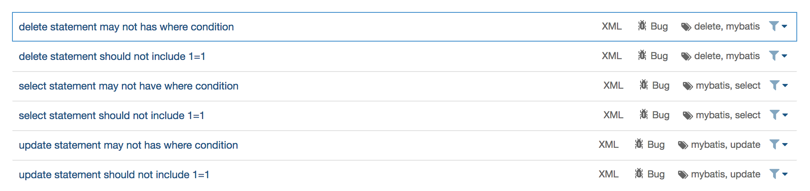
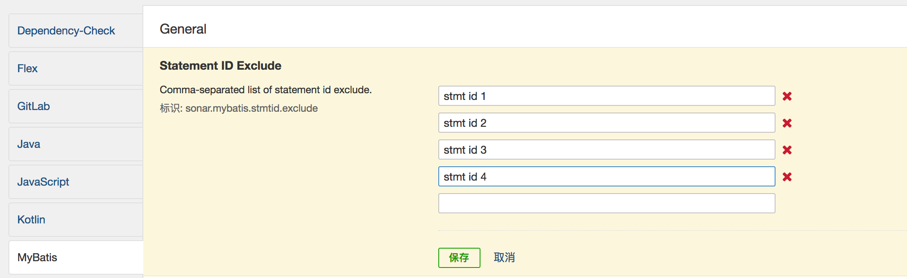

[](https://travis-ci.com/donhui/sonar-mybatis)
[](https://sonarcloud.io/dashboard?id=donhui_sonar-mybatis)
[](https://github.com/donhui/sonar-mybatis/releases/)
[](https://github.com/donhui/sonar-mybatis/releases/)

[README 英文版](README.md)

## SonarQube MyBatis 插件
MyBatis SonarQube Plugin ：自定义规则用于检查 MyBatis Mapper XML 文件中的风险 SQL。

## 什么是风险 SQL?
风险 SQL 是指在 mybatis mapper 文件中，有一些动态 SQL，例如 `<if test=""></if>` 元素，
如果 Mapper XML 中的 SQL 语句中的所有参数为 null，那么 SQL 会有比较大的风险。

示例如下:

```
DELETE FROM table_name
WHERE 1=1
<if test="startTime != null">
    AND start_time <![CDATA[=]]> #{startTime}
</if>
<if test="endTime != null">
    AND end_time <![CDATA[=]]> #{endTime}
</if>
```

## MyBatis 规则
有7个内置的规则，select 语句有3个规则，update 以及 delete 语句分别有2个规则。



## 如何安装？
在SonarQube中安装插件有两种选择：
- 应用市场（Marketplace） - 自动从 SonarQube UI 安装插件。
- 手动安装 - 如果您的 SonarQube 实例无法访问互联网，请将使用此方法。

### 应用市场（Marketplace）
如果您能够访问互联网，并且您的用户具有全局权限“管理系统”的权限，则可以访问"配置 > 应用市场"。
- 通过搜索 `mybatis` 找到该插件
- 点击安装然后等待下载完成

下载完成后，将使用“重启”按钮重新启动 SonarQube 实例。

### 手动安装
该插件可以从 [github release](https://github.com/donhui/sonar-mybatis/releases/) 下载。

将下载的 jar 放到 `$SONARQUBE_HOME/extensions/plugins` 目录，并移除该插件的旧版本。

一旦完成，您将需要重新启动 SonarQube 服务器。

## 如何使用？
使用 maven 构建命令的示例如下：
```
mvn clean compile -U -Dmaven.test.skip=true -Dmaven.javadoc.skip=true sonar:sonar -Dsonar.host.url=http://127.0.0.1:9000/ -Dsonar.projectKey=demo -Dsonar.projectName=demo -Dsonar.sourceEncoding=UTF-8 -Dsonar.sources=. -Dsonar.inclusions=src/main/** -Dsonar.exclusions==src/main/webapp/**
```
要想分析 mybatis mapper 文件， `src/main/resources` 目录必须在 `sonar.sources` 中。

## 支持全局 Stmt ID 排除列表
对于一些特殊语句的问题，要想忽略它们，可以将附带 namespace 的 statement id 放入全局 stmt id 排除列表。



## 跳过 MyBatis 扫描
如果有时候想要跳过 MyBatis 扫描，你可以修改全局属性 `sonar.mybatis.skip` 为 `true` 或者在命令行中添加参数：
`-Dsonar.mybatis.skip=true` 。

## 贡献
可以在 https://github.com/donhui/sonar-mybatis/issues 提交 bug 和新功能请求。

或者可以提交 pull requests 用于修复 bug 或提交新功能，欢迎任何形式的贡献。

# Star 趋势图

[](https://starchart.cc/donhui/sonar-mybatis)
